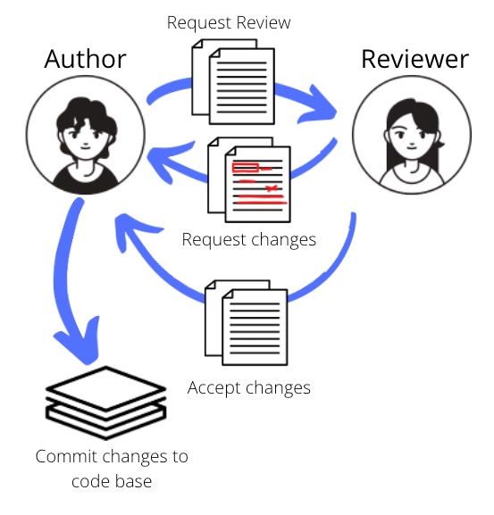

<h1 align="center">Improve Your Code Review Game</h1>

Coleen Ho

April 2022

 

Ah, the code review process.  A necessary, but yet commonly misunderstood part of the development process for a software engineer.  For the junior engineer, it’s an intimidating event where you go before a seasoned engineer with your precious code you’ve spent 1 month or more working on, only to feel it ripped to shreds.  This isn’t a pleasant experience for the senior engineer either.  So what can be done to help alleviate this pain point to where it becomes an effective experience?  By building in structure and setting realistic expectations for the code reviews process, engineers can come better prepared and walk away at the end of them unscathed and feeling productive.

The purpose of code reviews is to identify potential defects early.  However, they also provide value like building in quality early, sharing knowledge about the code, and reinforcing a learning mindset.  Learning is a critical by-product of the code review because it promotes collaboration around a new idea or technique and helps reinforce best practices for coding.

Engineers will find themselves on both sides of the review process: **The Author** or **The Reviewer**.  The Author is the engineer who made code changes and presents them to another engineer (including architects and managers).  The engineer who is presented with the code changes is The Reviewer--they review the code and identify any issues associated with the proposed changes and make requests for change to The Author.  The Author will conform or dispute the requested change from The Reviewer.  This process will iterate until The Reviewers accept all the code changes.  The code review process concludes when the Author commits the approved changes to the code base.

In the remainder of this document, strategies for each role will be introduced along with guidelines to enhance the code review process.  Note: The Author and The Reviewer can refer to multiple people in each of these roles.  However, these roles will be referred to in the singular form in this paper to keep things simple.

## The Game
A while back I was at a company where I sat near one of the software architects.  I could tell he was really great at his craft, so I frequently sought him out to do my code reviews.  I figured I could learn a lot from him.  My first couple requests for change from my code reviews were incredibly dense; they were detailed, but nit-picky.  I couldn’t believe the amount of things he put in a review; one line of code could easily generate three or more requests for change! 

After a few more reviews, I started improving and getting less requests for change.  For me, it became a challenge; a game of sorts.  I wanted to see whether I could get a code review from this Architect and receive no requests for change.  I turned this initially daunting process into something fun and enjoyable for the first time in my career and I aim to share these best practices with all engineers to improve the code review process.

Consider each role of the code review as a player in the game.  As The Author, the code review is a game consisting of simply trying to improve your own “score” or number of requests for change.  Each code review should see overall requests for change diminish.  For The Reviewer, the game is a little different where their objective is to eliminate leaked defects, improve code quality, and minimize tech debt.  Both players need to ensure the code base is continuously maintained and enhanced but not at the expense of sacrificing quality.  For the game there is not an actual score per say, but you should try to quantify it in some meaningful way for yourself to mark progress as a player.  Examples for keeping score are provided at the end of the paper.

## The Author
Long before a code review takes place, there are certain things that can help set you up for success for a code review.  
Make small changes: Make code changes as small as possible.  No one wants to be invited to a code review with 20 or more files that include over 400 lines of code that were modified.  Plan your code changes in incremental chunks.  This makes the review process run smoother and quicker because there are smaller bite size bits of code (no pun intended) to digest.  It will also make it easier to find any potential issues.
Set context: Describe the changes you are making and why.  This can be done in the code itself, technical documentation, description in the code changelist, or in a ticket system. It also provides traceability; months or years from now someone can understand why you put a change in place.
Establish quality: Ensure your code builds, tests pass, and code coverage at an acceptable level.  Fixing a bug?  Make sure you’ve added a test to cover the fix you are implementing.  No tests exist at all?  Then be the first to add a test; it’s gotta start sometime and it will make the code base all the more stronger!

Once you are ready to begin with a code review, follow the guidelines below to help you proceed through the phases of the code review.
#### Code Review Guidelines
The code review process includes three distinct phases: before, during, and after code review.  Each phase includes several key aspects and optional checklists to ensure a successful and productive code review occurs.  I’ve learned and discovered many of these aspects through my own experience as The Author of code reviews.  My aim is to make the process of reviewing my code as easy for my Reviewer as possible and this is accomplished through preparation on my side as the Author.
Phase 1: Before Code Review
In order to promote a successful code review, prepare yourself and The Reviewer by establishing the context for the changes, ensuring the code quality is maintained, and the appropriate format for the review is established before the code review begins.
##### Context
A description is necessary to help establish context and provide the necessity for the change you are introducing.  State your case for adding this code–imagine someone is just asking you, “Why are you adding/removing this code?”  You should provide this answer for your reviewers.
##### Code Quality
Verify the code compiles/builds, runs, and tests pass (and meet code coverage goals) to ensure the quality of the code is maintained and enhanced.  In order to demonstrate the scope of the changes (as well as a continued enforcement of those changes), tests should be added/modified as necessary.  This serves as a sort of insurance policy that your code will continue to work as expected despite changes that occur around it.
##### Reviewers and Review Format
It is best to include more reviewers rather than fewer depending on the scope of the review.  This provides the team with flexibility about who is reviewing the code and when; it also broadens the awareness of code and its changes without formally sharing them out.  Lastly, consider the preferred format (live or offline) for your review.  A live code review has The Author walk The Reviewer through the code changes versus an offline review where The Reviewer reviews the code on their own time without direct interaction with The Author.  See Table 1 below for a comparison between live and offline code reviews to determine the best match for your code review.  Also, consider the option of doing both a live and offline review with The Reviewer.

Table 1: Comparison of Live and Offline code reviews
| | Live | Offline
Driver of Code Reviewer| Author | Reviewer
Speed of review | Possibly Faster | Slower
Depth of scope | Brief (might miss issues) | Thorough
Changelist size/impact | Preferred for complex, impactful, or large changes | Best for small, simple changes

Note, The Reviewer has the option to request a live code review to clarify any changes.  This helps reduce the back and forth in offline reviews and enhances the review process.

Do live code reviews if the changes are large, impactful, or complex; offline code reviews are perfect for simple or minimal code changes that don’t require much discussion. 

To ensure preparedness for your review, use the following checklist:

Before Review Checklist
- [ ]Provide Description (describe what the code change is and why it is needed)
- [ ]Ensure code compiles/builds
- [ ]Validate code runs
- [ ]Verify tests pass
- [ ]Add/modify tests to handle the code change
- [ ]Meet code coverage (or aim for 75-85% test coverage)
- [ ]Check all the Gotchas are avoided (see the Gotchas section)
- [ ]Identify reviewers and roles (see end of The Reviewer section)
- [ ]Decide live or offline review
If holding a live code review, present the changes in a logical flow.  Suggestions:
APIs, UI, or database level first
Data flow
Tests first

Once you’ve covered all aspects of the Before Review Checklist from above, you can feel more confident inviting The Reviewer to assess your changes.  Work with your Reviewer to determine when you can expect feedback.
Phase 2: During Code Review
If there are requests for change to your code, do not take it personally.  The Reviewer has assessed your code and is simply asking for a rewrite based on their opinion.  You can, and should, discuss this request for change with The Reviewer if you don’t agree with it or understand it.  This becomes an excellent learning opportunity!  This was a vital step I learned in the code review process.  It’s important to understand why a rewrite is required to prevent the issue from occurring again and to be able to watch out for it in other engineer’s code reviews.  Writing code is just like writing a book.  There is room for disagreement, but we need to strive to come to a consensus on what is best for the code base.

Do your best to set your ego aside.  Come to a code review with an open mind.

Phase 3: After Code Review
Circling back to the beginning when the concept of the code review as a game was introduced, you should evaluate how your code reviews are going.  Do you see improvements in your game?  If not, keep working to identify the Gotchas before a code review happens.  Seek out counsel from other engineers before and during code to minimize the requests for change in a code review.  Try to improve your own personal code review score.  Keep in mind, this is just a measurement you define, not one that would be assessed from any of The Reviewers.  Check out the following checklist for items to conclude your review:

After Review Checklist
- [ ]Identify your own list of Gotchas
- [ ]Strive to avoid these mistakes in your future code reviews 
- [ ]Be sure to reciprocate and review code changes from your Reviewers
- [ ]Learned something new

If you find for your code reviews there are little to no requests for change occurring, it doesn’t mean that you have reached the end of the Game.  Instead, it means that it might be appropriate to seek more difficult problems in your coding work.  Or perhaps you need to extend yourself in a different direction–try a different coding language, contribute to another teams’ work, or code something for the front end if you are a backend developer (or vise versa).  There are limitless possibilities when it comes to opportunities for writing code and having it reviewed.  Find new ways to play the Game–don’t limit yourself to just one.

Learning something new or a better way to do something is a great outcome from any code review.  Consider these bonus points from your review!  Be sure to share what you learned because it’s very likely that another engineer could learn from you.

Not confident being a Reviewer quite yet?  Ask to join Reviewers on their code reviews and watch to learn.  Like most things in life, however, the only way to get better at it is to practice it to the point where you can teach others.  So be encouraged to take the risk and review code regardless of your career level; when you can identify issues in other engineer’s code, you in turn avoid making those mistakes in your own code.

Utilize the list of Gotchas to identify areas in the code you are comfortable reviewing.  Then challenge yourself and pick one or two Gotchas you aren’t as familiar with and practice reviewing with those in mind so you can grow your reviewing and coding skill.  The more code you review (or watch being reviewed), the stronger your development skills will become.

## The Reviewer
Being part of a code review should be viewed as a privilege, not a burden.  It says The Author values your point of view and feels you have something worthwhile to contribute to their work.  This request should be taken seriously whenever you review code. Try to offer suggestions if warranted, but realize also that there is also a lot of work that went into The Authors’ changes.  Those changes in themselves should be recognized because they matter. 

Challenge yourself to provide positive comments in a code review.

Prepare yourself for the code review.  Set aside time aside (10-60 minutes) to do the code reviews, and preferably as soon as you are invited so you can provide timely feedback to The Author.  If you’re invited to a live code review, be sure to review all the changes beforehand and prepare your questions for the meeting.  For both live and offline reviews, follow the checklist below to prepare yourself for the review, and identify common mistakes that reviews uncover (see the Gotchas section near the end of the paper).
### Code Review Guidelines
Just as The Author has three phases of the code review process, so does The Reviewer: before, during, and after code review.  Unlike The Author, whose before code review is the largest phase in terms of scope, The Reviewer will spend most of their time in the second phase.  Still important, however, Phase 1 (before code review) will help The Reviewer determine whether a code review is actually ready or not and prepare for the remainder of their time in Phases 2 and 3 of the code review process.

All too often I see engineers who try to review code they aren’t ready to review.  Why is this?  Because they haven’t gone through Phase 1 of the code review process.  They jump immediately to phase 2.  Phase 1 establishes the viability of the code review and creates a plan for the code review.
### Phase 1: Before Code Review
Assess the code review request.  Be sure to ask The Author for anything you may need: context and additional Reviewers (or the list of Reviewers).  Collaborate with other Reviewers to discuss an approach for the code review.  If, after beginning a code review, there are a number of changes that are necessary, it’s best to request a live code review to discuss any concerns you have about the code changes.  Doing this live will alleviate a lot of the back and forth that can happen during a review and clear up any misunderstandings on either side (along with preventing any frustrations or other negative interactions).  

This flexibility in the format for a code review is important; I’ve been a part of many code reviews where if held in a live setting would result in writing less feedback.  Oftentimes if I am reviewing code and there are too many comments or something is unclear to me, I will request a live code review so we can look at the code together, ask questions, and get clarification on the spot thus moving the process along quicker.

For large code reviews, consider dividing and conquering with the other Reviewers.  One option is for Reviewers to review different files.  Another option is each Reviewer focuses on a few Gotchas across all changes.  Reduce the redundancy of code reviews just like you would reduce the redundancies in code.  All the Reviewers don’t need to review all the changes against all the Gotchas; break apart the code review and tackle it together.  Team work makes the dream work!

When you are ready to proceed with the code review, step through this checklist to make sure you are prepared before moving ahead with the review:

#### Before Review Checklist
- [ ] Review Description (understand what and why this change is needed)
- [ ] Understand the requirements
- [ ] Ensure code compiles/builds
- [ ] Check code runs
- [ ] Make sure tests pass
- [ ] Verify tests are added/modified and handle the code change
- [ ] Confirm team’s code coverage standard reached
- [ ] Identify your scope for the review
- [ ] Prepare 10-60 minutes for the review (based on the size of the code changes)

Exceeding 60 minutes in reviews requires either breaking the changes into more reviews or ensuring the requirements are clear.

### Phase 2: During Code Review
Think of code reviews as the same process that writers go through with editors.  It’s not about bashing how or what The Author wrote.  This is a time to be constructive–offer suggestions for improvement as much as possible and provide justification.  Don’t just simply identify what the issue is.  Be respectful with your feedback; focus on the problem and not The Author.

For example, take these lines of code under review:
`for (int i = 0; i < n - 1; i++) {
    for (int j = 0; j < n - i - 1; j++) {
        if (arr[j] > arr[j + 1]) {
            // swap arr[j+1] and arr[j]
            int temp = arr[j];
            arr[j] = arr[j + 1];
            arr[j + 1] = temp;
        }
    }
}`
Avoid using hyperbole such as, “This change will destroy performance”.  Instead, confirm the change is intended like, “It seems like this might be a slower solution.  Do you intend to have a double nested for loop?”  This will help guide The Author through your feedback and provide them with something tangible to address.  Furthermore, notice your tone and language in your feedback.  You should avoid phrases like “obviously” and “why did you do this?”  This can lead to adversarial reviews and makes people defensive or feel hurt.

Also, be mindful of the requests for change and their severity.  If something isn’t critical, call it out as a nit (as in nitpick).  This signals that it isn’t necessary to modify, but it is more suggestion based on an opinion like this: “Nit: can you change the variable name from ‘dt’ to ‘dailyTotal’ to make it clearer what it’s for?”.

It’s important to convey why a request for change is warranted.  The Author oftentimes has already attempted to provide the best solution they can, so it is vital you provide recommendations and justifications for your recommendations.

Provide recommendations with justification, not just feedback.

Don’t get distracted by things other than the actual changes The Author made.  If you notice something else outside the review at hand, take note and handle that independently.  Take care to keep the review on track (very important during live code reviews); you want to get through as much of the changes as quickly as possible.  If you get hung up on something, take note to discuss offline and move on.  If a solution to a request for change cannot be reached immediately, discuss this offline as well.  Sometimes it takes time (and perhaps the whole context of the changes) to realize what improvement is necessary and appropriate.

Along with minimizing distractions, consider the following list detailing concerns that fall outside of the code review:

Outside the scope of code reviews
Code that hasn’t been modified (if there’s an issue beyond The Author’s change, create a ticket for it)
Architectural or design discussions (handle these in a separate meeting and conclude the code review if it will be impacted by these kinds of changes)
Personal preferences when it comes to coding style (refer to actual deviations  from the established coding standard for your team/company)

Use the following checklist to guide you through the reviewing portion of the code review:

During Review Checklist
- [ ]Consider all possible cases (happy path and sad path)
- [ ]State assumptions and where changes might break when those assumptions don’t hold
- [ ]Focus on new code and confirm it fulfills requirements
- [ ]Identify exceptional cases and whether they are handled (and tested)
- [ ]Utilize language specific features
- [ ]Give positive and constructive feedback
- [ ]Check the Gotchas list of common mistakes
Phase 3: After Code Review
To conclude the code review, ensure The Author and other Reviewers know you are finished.  Proceed with this checklist to wrap up your portion of the review process:

#### After Review Checklist
- [ ]Follow up with Author
- [ ]Confirm feedback is understood

## Gotchas
Regardless of the coding language, there is a list of Gotchas (common things that are identified as requests for change) that occur from code reviews.  These Gotchas can be classified according to how easy and quickly it is to identify them, which can directly relate to the issues they cause in a code base (think little to severe).

Easy Gotchas are the low hanging fruit and in some cases can be identified automatically through the use of tools (think linters, spell checking, code coverage, IDEs, etc).  They may not cause many issues in themselves, but correlate to a lack of maintainability for the code base.  The mid-level issues are Medium Gotchas.  These take more time to identify but usually appear in code that is not well thought out or sloppy.  Medium Gotcha will cause defects and should be carefully reviewed.  And lastly, Hard Gotchas are the highest level of issues and require the greatest level of attention.  Typically the Hard Gotchas can only be identified through a holistic view of the application.  Basically, you need to have the entire context and be able to place these changes from the code review into it.  This requires seeing beyond the changes themself, and observing the consequence of these changes from the code review.

Unfortunately, Easy Gotchas often obscure the Medium and Hard Gotchas.  Thus it is important to ensure Easy Gotchas are caught before starting code reviews, so the higher level issues can be identified.  Consider the list of Gotchas below for the code review:

### Easy Gotchas
- Confusing or inappropriate names for variables, methods, classes/interfaces
- Hardcoded values
- Commented out code (just get rid of it, YAGNI)
- Imports (only include what you need, not the whole directory/package)
- Linting issues
- Not following Coding Standards
- Different Code Style
- Lack of comments in code
- Copy/paste mistakes
- Spelling
- Formatting

Automate as much of the Easy Gotchas as you can through code review tools, linters, IDEs, etc.

### Medium Gotchas
- Complex logic statements
- Handling exceptions
- Missing logging statements
- Neglecting to handle null, undefined, or empty string cases
- Hacks or work arounds
- Redundancy in code
- Maintainability
- Readability
- Edge cases not covered
- Tightly coupled code
- Requirements not met
- Minimal to no use of interfaces
- Extraneous, unnecessary changes
- Poorly structured code

### Hard Gotchas
- Multithreading issues
- Asynchronous code
- Performance concerns
- Lack of design pattern utilization
- Architectural issues
- Additional technical debt

If you uncover more than one Hard Gotcha, do a live code review.

Identify the Gotchas that you miss as a Reviewer or Author.  These should be key areas you need to focus on to grow as a Software Engineer.  Use the Easy, Medium, and Hard Gotcha levels to see yourself progress in your coding and reviewing skills.
Final thoughts
Keeping Score
For The Author, use the list of Gotchas and count up the number of Easy, Medium, and Hard Gotchas that were caught in your review.  Watch these scores over time to ensure the scores are improving.  Use the scoring method to identify key areas you can focus on in your coding.

The Reviewer, in contrast, can also consider other Review’s requests for change or leaked defects as part of their score.  Since the job of The Reviewer is to try to identify as many Gotchas as possible, it is important to take note (or score) when a Gotcha is missed or defect occurs–keep count of the Easy, Medium, and Hard Gotchas you missed, along with the severity of any defects that were leaked.  Just as The Author keeps score for themself, track your own missed Gotchas or leaked defects over time as The Reviewer.  This will aid you to identify key areas for enhancing your reviewing process.

Through ongoing practice and participation, both players of the code review game aim to achieve low scores.  This means fewer Gotchas are either found or missed and no defects are leaked–which is the ultimate objective of the game.
